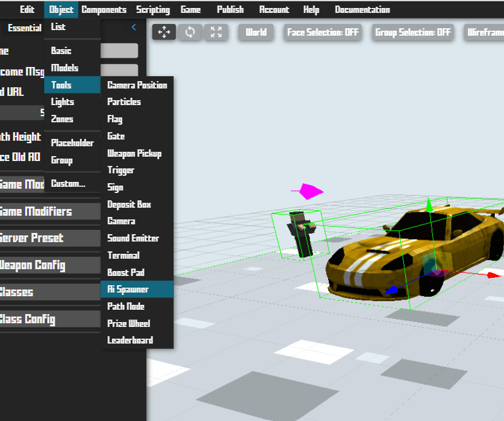

## Introduction

A basic game consists of a few simple components:

 * **Game Loop:** Timed loop to update the world.
 * **Game Elements:** Objects and Components in your game.
 * **Inputs/Controls:** User-actions & inputs.
 * **Feedback:** Response to user-actions & inputs applied to elements.
 * **Rendering:** Visual representation of game elements.

<br><br/>

## Timing

Time plays a very important role in any game/simulation.\
You can use it to make physics calculations or to simply add custom timers:

```krunkscript
# get current unix time
num nowTime = GAME.TIME.now();

# delta value
public action update(delta) {
	(num) object.x += ((num) object.speed * delta);
    # using delta ensures consistent speed
    # regardless of framerate
}

# stop default game timer:
GAME.TIME.freeze(); # server side only
GAME.TIME.unfreeze(); # server side only
```

You can create a simple countdown timer like this:

```krunkscript
# create value
num countdown = 10000; # 10000 ms = 10 seconds

# built-in update action:
public action update(num delta) {
    countdown -= delta; # delta is the time since the last frame/tick
    if (countdown <= 0) {
        countdown = 10000; # reset
        # this code will run every 10 seconds
        GAME.log("Custom Loop");
        # add more
    }
}
```

<br><br/>

## Players

KrunkScript allows you to interact with the default player objects:

```krunkscript
# find a player by their id
obj player = GAME.PLAYERS.findByID(
    id, # str player id
);
if (notEmpty player) { # can also use !player
    # do something
};

# access player list
obj[] players = GAME.PLAYERS.list();
for (num i = 0; i < lengthOf players; i++) {
    # do something
}

# get player object of active player
obj you = GAME.PLAYERS.getSelf(); # client-side only
```

You can change/access player values like with any other objects:

```krunkscript
player.position.x = 10; # set player x pos
(num) player.position.y += 0.1; # move player y pos
player.position.z = 10; # move player z pos
player.rotation.x = 0.3; # set player direction
player.velocity.x = 0.1; # set player velocity
(num) player.health -= 10; # change player health
player.visible = false; # hide player object
(num) player.sid; # short unique ID of player (can be used for sending network data in an optimized way)
(str) player.id; # long unique ID of player
(bool) player.onGround; # if player is on the ground currently
(bool) player.isCrouching; # if player is crouching
(bool) player.onTerrain; # player on terrain object
(bool) player.isYou; # (client-side) if this player is the current active client
player.assetID = "325253"; # update player asset (must have existing asset to work)
```

<br><br/>

## AIs & NPCs

AI can be used in several ways in your game. Krunker offers a built-in AI object.\
You can add them using the Editor or by using KrunkScript:

<p class="hidep"><strong class="server-side">server-side</strong></p>

```krunkscript
# add AI to world
obj testBot = GAME.AI.spawn(
    "11441g", # str asset id
    "bot 1", # str AI name
    0, # num x position
    0, # num y position
    0, # num z position
    {} # obj additional data
);

# include optional data to customize your AI object:
obj data = {

    animStart: "Idle", # str starting clip to play
    animSpeed: 0.5,    # num animation playback speed

    health: 100,       # num ai health value

    speed: 1.0,        # num speed multiplier
    turnSpeed: 1.0,    # num turn speed multiplier
    gravity: 1.0,      # num gravity multiplier

    respawnT: 1000,    # num respawn time (ms)
    respawnR: false,   # bool respawn random time

    targAI: false,     # bool target other AI
    targPlr: false,    # bool target players
    visionDis: 120,    # num vision distance
    chaseDis: 20,      # num AI chase distance

    canMelee: false,   # bool can melee hit
    meleeRate: 500,    # num meleerate (ms)
    meleeRange: 500,   # num meleeRange
    meleeDmg: 500,     # num meleeDmg
    canShoot: false,   # bool can shoot or not
    fireRate: 500,     # num firerate (ms)

    roamRadius: 0,     # num roamRadius
    roamTime: 0,       # num roamTime
    shotSpread: 0,     # num shotSpread
    shotBreak: 0,      # num shotBreak
    behaviorType: 0,   # num behaviorType
    score: 0,          # num score

    modelScale: 10,    # num model size
    hitBotW: 1,        # num hitbox width multiplier
    hitBoxH: 1,        # num hitbox height multiplier
    modelOffsetY: 0,   # num mesh y-offset
    modelRotation: 0,  # num mesh rotation offset

};

# you can remove an AI from the game by calling:
GAME.AI.remove(testBot.sid);

# if you want to get a list of all AIs:
obj[] ais = GAME.AI.list();
for (num i = 0; i < lengthOf ais; i++) {
    # do something
}

# you can also interact with a few properties on the AI object:
(str) testBot.displayName; # returns name of AI
(num) testBot.health -= 10; # change health
testBot.position.x = 10; # set position x,y,z
testBot.rotation.x = Math.PI; # set rotation x,y
testBot.behaviour = 1; # 0 = no default behaviour, 1 = default
testBot.pathIndex = 5; # pathnode indexes
```

Currently you are limited to 40 active AIs per game.\
An AI is consiered active if it has an active respawn timer or is currently alive.\
You can build custom behaviour onto the pre-built AI such as: **Interactivity, Custom movement, Custom Attacks, etc.**

---

You can also add an AI spawner via the editor:



<br><br/>

## Vehicles

Coming Soon

<br><br/>

## Movement

There are a few ways to create custom movement.\
In order to override/disable Krunkers default movement, you have to use KrunkScript:

```krunkscript
# disable default behaviour on spawn:
public action onPlayerSpawn(str id) {
    # get player object with id:
    obj plr = GAME.PLAYERS.findByID(id);
    if (!!plr) {
        plr.defaultMovement = false;
        # disable others if needed:
        # defaultRotation
        # defaultVelocity
        # these are reset on spawn
    }
}

# built-in player update action:
public action onPlayerUpdate(str id, num delta, static obj inputs) {
    # get player object by ID (this will be changed):
    obj plr = GAME.PLAYERS.findByID(id);
    if (!!plr) {
        if (inputs.jump) {
            # jump key pressed
            # make sure to add identical logic to client & server
        }
    }
}

# the player object holds some relevant properties which may be useful:
(bool) player.onGround; # if player is on the ground currently
(bool) player.isYou; # (client-side) if this player is the current active client

# the inputs object holds a few relevant input properties for movement:
(num) inputs.mouseY; # mouse y direction
(num) inputs.mouseX; # mouse x direction
(num) inputs.movDir; # W,A,S,D inputs converted to direction
(bool) inputs.lMouse; # left mouse down
(bool) inputs.rMouse; # right mouse down
(bool) inputs.jump; # jump key bar down (space by default)
(bool) inputs.reload; # reload key down
(bool) inputs.crouch; # crouch key down
(bool) inputs.scroll; # scroll wheel delta
(bool) inputs.swap; # swap keys
(bool) inputs.restK; # reset key (parkour)
(bool) inputs.inter; # interact key down

# you can disable the default behaviour of each of these keys separately:
player.disableDefault("jump");
# ignores all default krunker behaviour
# associated with the jump key: jumping etc
# this is reset on spawn
```

If you want to simply make changes to Krunkers default movement, such as: **Speed, Velocity, Jump Height, etc**, you can simply use the Class Configuration in the Editor.

<br><br/>

## Collisions

Nothing Here Yet

<br><br/>

## Controls

Nothing Here Yet

<br><br/>

