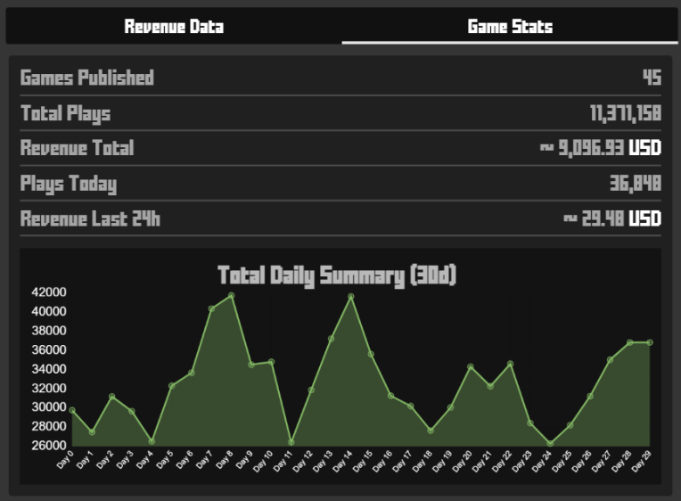

## How to make Money

Krunker offers several ways for game developers to earn money from their creations.\
In order to qualify for payouts you must be an approved [Krunker Partner](./files/revenue?id=krunker-partner).

<br><br/>

## Gameplays

Everytime someone plays your game, you get paid. This revenue share is calculated\
based on ad impressions on your game:


revenue (USD) = ((gameplays / 1000) * 0.08)

<br><br/>

## Video Ads

Using KrunkScript you can choose to display a video-ad on the players screen. Here are some use-cases where it makes sense to display a video-ad:

 * **Reward for watching:** Coins, Items, Stage Skip etc
 * **Between game rounds:** Play an ad when the round ends.
 * **On death:** When a player dies, you can play an ad if enough time has passed since the last ad.\

It is important that you make the ads as non-intrusive as possible. If uses are complaining about the presence of ads, you are doing it wrong.

___

Example Script:
<p class="hidep"><strong class="client-side">client-side</strong></p>

```csharp
// play fullscreen video ad
GAME.ADS.playVideo(); // can only be called every 5 mins
```

<br><br/>

## Referral Link

A referral link allows us to track how a new player comes to krunker. When a player signs up with your referral link, you get paid every time they play any krunker game. To fully take advantage of this system, make sure to include your referral code when sharing your games URL: [https://krunker.io/?play=AIM_Room&ref=CODEHERE](https://krunker.io/?play=AIM_Room&ref=CODEHERE)



revenue (USD) = (hours played * 0.04)

<br><br/>

## In App Purchases

Coming Soon...


<br><br/>

## Krunker Partner

Krunker Partners are able to earn money from Krunker in several ways depending on their Partner Status:

 * Referral Code: All Partner Levels
 * Gameplay Revenue share: Partner Level 2

If you are not a Partner yet, navigate to the Profile » Partner tab in-game. \
Partner Level 2 is achieved by reaching 100,000 plays in the last 30 days.

<br><br/>

## Retaining Players

Player retention is very important if you want to create a consistent revenue stream. A few ways you can keep players around for longer are:

 * Unlockables & Progression: Offer players a goal to strive towards. If they can unlock new content over time, they have a reason to come back.
 * Replay Value: Offering multiple gameplay options is another great way to keep players coming back.
 * Achievements: Additional things for players to work toward.
 * Content Updates: Adding new features & content frequently not only helps you fix or adjust issues, but also keeps players interested.
 * Community: Build a community around your game. And be sure to update them around changes to your game.

<br><br/>

