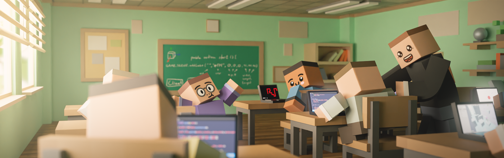
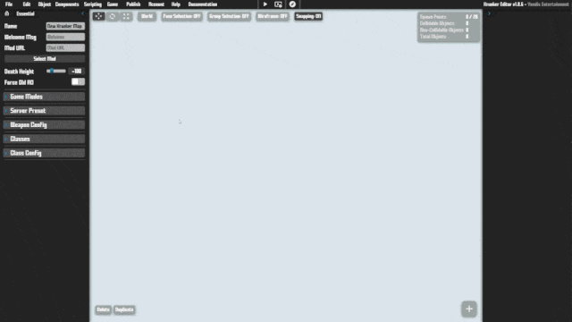

## Introduction



Scripting allows you to create custom logic for your game.\
You can also interact with game elements such as: **objects**, **interface**, [Overlay Canvas](./files/rendering_2d?id=overlay-canvas), **sounds**, **animations & more**.\
If you are not sure how to create your own script, we have created a few [Examples & Templates](./files/examples_&_templates) for you to learn from.\
Alternatively you can search for scripts in the **Community Asset Hub**.

## Script Types

There are 3 types of scripts in KrunkScript:

___

**client.krnk:** This script is responsible for handling the core of the game logic on the client.\
Its generated for every game and offers a few [Default Actions](./files/scripting?id=hook-actions) to help you out.

___

**server.krnk:** This script is responsible for handling the core of the game logic on the server.\
Its generated for every game and offers a few [Default Actions](./files/scripting?id=hook-actions) to help you out.

___

**Addon Scripts:** These scripts can be imported into the client or server scripts and allow you to modularize your code.\
Addon scripts can be found on the **Community Asset Hub**

## Create a Script

To create a new script, navigate to the 'Scripting' button in the editor:



## Server/Client

Scripts can be run both on the server and the client.\
Some actions however are specific to one or the other.

Anything rendering related for example will run only on the client.\
It is important to understand the difference between the two.

## Hook Actions

The client and server have a few auto generated actions to make things easier for you and to interact with default Krunker elements.

___

**start():** The start action is called every time the game starts on both the server and the client.\
Use this to load data, initialize the world, reset things after a round has ended & more.

```krunkscript
public action start() {
    # add code here
}
```
___
**update():** The update action is called every frame on both the server and the client.\
Recommended to be used for things like: Updating the World, Updating AIs & Objects.

```krunkscript
public action update(num delta) {
    # delta is the time since the previous update
    # add logic here
}
```

___

**render():** The render action is also called every frame on the client. Recommended to be used for things like:\
Rendering on the [Overlay Canvas](./files/rendering_2d?id=overlay-canvas).

<p class="hidep"><strong class="client-side">client-side</strong></p>

```krunkscript
public action render(num delta) {
    # render elements here
}
```
___

**onPlayerSpawn():** Called on server & client. This is called whenever a player spawns in.\
Could be used for things like: Assigning player objects to global, spawn in messages/sounds etc.

```krunkscript
public action onPlayerSpawn(str id) {
    # get player object with id:
    obj plr = GAME.PLAYERS.findByID(id);
    if (!!plr) {
        # do something
    }
}
```

---

**onPlayerUpdate():** Called on server & client. Works similarly to the update action, however it is synchronized to the player.\
Use this for overriding Krunker's default movement or for creating your own custom movement.\
Do not use it for updating game objects or making non-client-predicted movement.

```krunkscript
public action onPlayerUpdate(str id, num delta, static obj inputs) {
    # get player object with id:
    obj plr = GAME.PLAYERS.findByID(id);
    if (!!plr) {
        # do something
		# custom movement etc
    }
}
```

---

**onGameEnd():** Called on the server. This is called whenever the game ends.\
Could be used for things like: resetting a counter, updating data storage, etc.

<p class="hidep"><strong class="server-side">server-side</strong></p>

```krunkscript
public action onGameEnd() {
    # do something after the game ends
}
```

---

**onAdFinished():** Called on the server. This is called whenever a player finishes an [ad video](./files/revenue_&_currencies?id=video-ads).

<p class="hidep"><strong class="server-side">server-side</strong></p>

```krunkscript
# When a player finished a video
public action onAdFinished(str playerID, bool success) {
    # playerID is the ID of the player who finished the ad video
    # success is whether the task was successful or not
}
```

---

**onPlayerDeath():** Called on server & client. This is called whenever a player dies.

<p class="hidep"><strong class="server-side">server-side</strong></p>

```krunkscript
# id = player id, killerID = killer ID
public action onPlayerDeath(str id, str killerID) {
    # example
    obj killer = GAME.PLAYERS.findByID(killerID);
    str msg = !killer.username ? # if killer exists
		"What was that" :
		"Time to get revenge on " + toStr killer.username;
    GAME.CHAT.send(id, msg, "#ff0");
}
```

---

Both scripts also have built-in network listener actions that are called automatically when a message is sent through the network. [More Information](./files/multiplayer_&_networking?id=receiving-data)
___
Additionally, the client.krnk script has a few [Input Listener](./files/inputs?id=input-listeners) and [UI Interaction](./files/inputs?id=click-events) actions built-in.
___
And, the server.krnk script has [Trigger Interaction](./files/trigger_logic?id=triggers-amp-scripts) actions built-in

## Default Behavior

Krunker offers a lot of default behavior out of the box to make things easier.\
You can disable certain behaviors to further customize your game:

```krunkscript
GAME.DEFAULT.disablePrediction(); # disable client prediction (client only)
GAME.DEFAULT.disablePlayerBehaviour(); # disables all default player logic (needed on client & server)
player.defaultMovement = false; # disables default player movement, jumping & crouching (needed on client & server)
player.defaultVelocity = false; # disables default player movement (needed on client & server)
player.defaultRotation = false; # disables default player direction and rotations (needed on client & server)
player.disableShooting = true; # disables shooting & reloading
player.disableMelee = true; # disables melee
player.disableDefault("jump"); # disable other default behaviours
GAME.DEFAULT.disable3D(); # disable 3D Scene (For 2D Only Games) (client only)
GAME.DEFAULT.disableServerSync(); # disables server sending player data every tick (server only)
GAME.INPUTS.disableDefault(); # dont execute or send default player inputs to server (client only)
GAME.UI.hideDefault(); # disables most default krunker UI (client only)
GAME.UI.hideCrosshair(); # disables crosshair (client only)
GAME.PLAYERS.disableMeshes(); # hides default player models (replace with custom)
```

## Variables

Variables are used to store information

```krunkscript
# create variables
num number = 1; # number (int/float)
str text = "hello world"; # string/text
bool val = true; # boolean
```

## Naming Rules

KrunkScript has strict property naming rules

```krunkscript
# naming rules (must begin with character or _)
num test = 0; # valid
str _test = "hi"; # valid
num 0test = 0; # invalid
num test0 = 0; # valid
obj name = {}; # valid

# no special characters allowed
```

## Type Conversion

Converting from one type to another

```krunkscript
num number = 1; # create number
str text = (str) number; # cast to string
str text = toStr number; # convert number (deprecated)
num newNum = toNum text; # convert to string (deprecated)

num test = toNum "0"; # valid (deprecated)
num test2 = toNum "a"; # invalid: returns 0 (deprecated)
```

## Objects

Objects are used to store a collection of information

```krunkscript
# create basic object
obj car = {
    name: "Toyota", # text property
    x: 0 # number property
};
(num) car.x += 1; # example
car.y = 10; # assign new property to car object

# you can create an empty object to be used later:
obj other = {};
if (notEmpty other) {
	# this condition would fail
}
```

## Arrays (Lists)

Arrays/Lists are used to store several objects/values of the same type

```krunkscript
# create basic object array
str[] list = str["a", "b"]; # list of strings
obj[] list = obj[{ # list of objects
    a: 1
}, {
    a: 5,
	b: 10
}];

# create list of numbers
num[] list = num[1, 2, 3, 4, 5]; # list of numbers
num test = list[0] + list[1]; # access list values

lengthOf list; # returns length of list

remove list[0]; # remove first item from list
remove list[i]; # remove specific index from list

addTo list 10; # add new item to list

# nested lists
num[][] nested = num[][num[1], num[1, 2]];
```

## Functions & Actions

KrunkScript allows you to create custom actions (traditionally called functions). For example you could create an action that moves a car and depletes fuel from said car:

```krunkscript
# create basic car object
obj car = {
    x: 0, # x position
    speed: 0.1, # cars speed value
    fuel: 100 # start with full tank
};

# drive action
action drive(num delta) {
    if ((num) car.fuel > 0) { # car only moves while it has fuel
        car.x = (num) car.x + ((num) car.speed * delta); # move car
        (num) car.fuel -= 0.1 * delta; # lose fuel
    };
}

# game loop (called automatically)
public action update(num delta) {
    drive(delta); # call custom action
    # render car etc
}

# return values
num action addFuel(num amount) {
    GAME.log("Added " + (str) amount); # convert num to string
    return amount;
}
car.fuel = (num) car.fuel + addFuel(10);
```

___

You can also use [Trigger Objects](./files/trigger_logic?id=trigger-logic) in your scene to call a custom script action by using the "Call Action" [Trigger Action](./files/trigger_logic?id=trigger-actions). The player object will be passed in (if available).

## Debugging


Use the following functions to help you when debugging

```krunkscript
GAME.log("Text"); # logs text to the browser console
GAME.log(object); # logs object to console
GAME.log((str) number + "text"); # log number concatenated to string
```

## Maths & Calculations

We provide a few built-in Functions & Properties to make certain calculations easier for you.

___

**Calculations & Operators**

```krunkscript
num value = 1 + 1; # addition
num value = 10 - 1; # deduction
num value = 2 * 1.5; # multiplication
num value = 2 ** 2; # power of
num value = 2 / 1; # division
num value = 10 % 5; # modulo
value += 10; # add to value
value++; # add 1 to value
value -= 5; # subtract from value
value--; # deduct 1 from value
num x = 3 << 1; # bitshift left
num x = 3 >> 2; # bitshift right
num x = 2 >>> 1; # unsigned right shift bit operation
num value = 2 * (5 - 3) # brackets
```
___

**Basic Math Functions & Utilities:** built-in functions of the most common math operations & methods.

```krunkscript
Math.E # returns euler's number
Math.PI # returns PI
Math.PI2 # returns PIx2
Math.sin(num) # returns sin of number
Math.sinh(num) # returns hyperbolic sin of number
Math.cos(num) # returns cosin of number
Math.cosh(num) # returns hyperbolic cosin of number
Math.tan(num) # returns tan of number
Math.tanh(num) # returns hyperbolic tan of number
Math.asin(num) # returns asin of number
Math.asinh(num) # returns hyperbolic asin of number
Math.acos(num) # returns acos of number
Math.acosh(num) # returns hyperbolic acos
Math.atan(num) # returns atan of number
Math.atan2(num) # returns atan2 of number
Math.atanh(num) # returns hyperbolic atan
Math.log(num) # returns logarithm of number
Math.exp(num) # returns exponent of number
Math.pow(num, pow) # returns power of number
Math.abs(num) # returns absolute (non-negative) number
Math.round(num) # returns rounded number (non-decimal)
Math.trunc(num) # removes decimals from a number
Math.roundToNearest(num, near) # returns number rounded to nearest
Math.roundDecimal(num, decimals) # returns number reduced to certain decimals
Math.floor(num) # returns rounded down number
Math.ceil(num) # returns rounded up number
Math.hypot(...args) # returns hypotenuse of values
Math.sqrt(num) # returns square root of number
Math.min(num1, num2) # returns lowest of two values
Math.max(num1, num2) # returns highest of two values
Math.lerp(num1, num2, amnt) # returns rounded down number
Math.calcPerc(num, perc) # returns percent value of number
```
___

**Random Number Generation:** Easy way to generate random numbers within a range

```krunkscript
UTILS.randInt(x, y) # random integer between x and y
UTILS.randFloat(x, y) # random float between x and y
```

___

**Distance Calculations:** Calculate the distance between 2 objects or points

```krunkscript
UTILS.getDist2D(x1, y1, x2, y2) # distance between 2 points in 2D space
UTILS.getDist3D(x1, y1, z1, x2, y2, z2) # distance between 2 points in 3D space
```

___

**Angle Calculations:** Angle & direction related calculations

```krunkscript
UTILS.anglDst(x, y) # difference between 2 angles in radians
UTILS.getDir2D(x1, y1, x2, y2) # direction between 2 points in radians
Math.toRad(num) # converts degrees to radians
Math.toDeg(num) # converts radians to degrees

# 3D directions
obj dirs = UTILS.getDir3D(x1, y1, z1, x2, y2, z1) # directions between 2 points in radians
obj.x; # x direction
obj.y; # y direction
```

## String Manipulation & Testing

You can use KrunkScript to manipulate strings in several ways:

```krunkscript
str testString = "test"; # create string
str string2 = testString + "Me"; # concatenate strings
str string3 = UTILS.toUpper(testString); # results in: TEST
str string4 = UTILS.toLower(testString); # results in: test
str string5 = UTILS.truncateTxt("123456", 2, true); # results in: "12"
str string6 = UTILS.truncateTxt("123456", 2, false); # results in: "12..."
str string7 = UTILS.replaceText("hello there", "the", ""); # results in: "hello re"
```

You can also check certain properties of a string:

```krunkscript
str testString = "test"; # create string
if (UTILS.textContains(testString, "test")) {
	# check if string contains certain value
}

# regex support coming soon
```

## Loops

Loops allow you to run certain code multiple times or to iterate over [Arrays](./files/scripting?id=arrays-lists)

```krunkscript
# create basic loop
for (num i = 0; i < 10; i++) { # loop 10 times
	# more code here
}

# iterate over array
str[] list = str["a", "b", "c"];
for (num i = 0; i < lengthOf list; i++) {
    GAME.log(list[i]); # log item in list
}

# while condition loop
num test = 10;
while (test > 0) {
	test--;
}

# you can break out of a loop (end loop entirely):
for (num i = 0; i < 10; i++) {
    if (i == 5) {
		break; # ends loop
	}
}

# you can also continue out of a loop (jump to next iteration):
for (num i = 0; i < 10; i++) {
    if (i == 5) {
        continue; # go to next iteration
    };
    GAME.log("Test " + toStr i);
}

# looping through objects will come soon
# ...
```

## Conditions & if Statements

If statements allow you to run certain code only if a certain condition is met. Here is an example:

```krunkscript
num value = 10;
if (value > 20) {
    GAME.log("Bigger than 20");
} else {
    GAME.log("Less than 20");
};
```

In this case, the second log would run. Because value is not greater than 20.\
Here is a list of operators you can use in your if statements:

```krunkscript
value > other # greater than
value >= other # greater than or the same
value < other # less than
value <= other # less than or the same
value == other # same as
value != other # not the same as

condition && condition # multiple conditions must be met
condition || condition # any condition is met

# you can also check if a value exists/is true:
if (!!value) {

}

# some examples
if ((10 < 5) || (5 == 10)) {
    # wont run
};
str test = "ab";
if (("a"+"b") == test && (1+1) == 2) {
    # will run
};

# ternary operations
num = (true?1:0);

# also make sure to wrap operations in ()
```

## Importing Scripts

You can add dependencies to your scripts to extend their functionality.\
To import another script, add it to your dependencies list in the Editor UI

<div class="disBar">Currently Disabled</div>

___

Once you can see the selected script in your dependencies list, load it into your main script like so:

```krunkscript
obj lib = import("scriptName"); # name as shown in dependencies list
```

\* Note that importing & publishing of scripts is currently disabled.

## Script Usage

Once you understand how to create a basic script, it's time to apply some logic to the game itself.\
Check the following sections for more info:

**GAME. Reference**\
[Render on 2D Canvas](./files/rendering_2d?id=2d-shapes)\
[Add 3D Objects](./files/custom_assets?id=3d-models)\
[Update 3D Object](./files/scene?id=moving_rotating-amp-scaling)\
[Move Camera](./files/cameras?id=updating-cameras)\
[Play Sounds](./files/custom_assets?id=sounds-amp-music)\
[Play Animation](./files/custom_assets?id=animations)\
[Add/Update Interface](./files/user_interface?id=adding-an-element-div)\
[Send Network Data](./files/multiplayer_&_networking?id=introduction)\
[Execute Triggers](./files/trigger_logic?id=triggers-amp-scripts)\
[Collisions](./files/game_logic?id=collisions)
