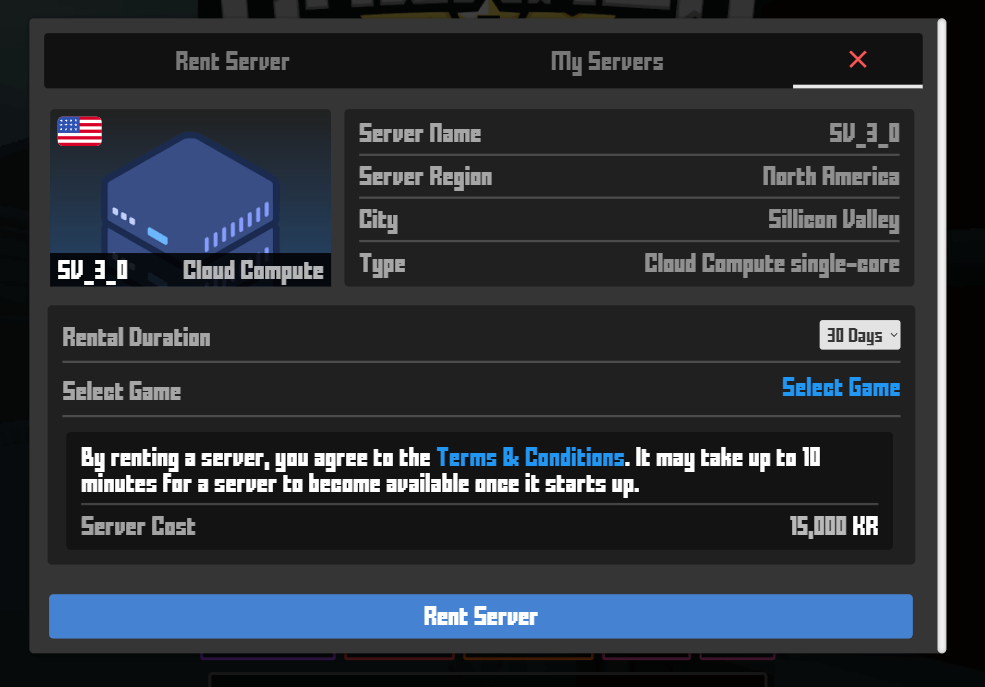

## Dedicated Servers

All games can be hosted manually by a player.\
However once that player leaves the lobby, the server is shut down.\
A dedicated server runs continuously and provides several other benefits:

* **Better performance**
* **Persists through Updates**
* **Better visiblity for your game on server browser**

## Create a Server

In order to purchase a dedicated server, navigate to the Host Game button on [Krunker](https://krunker.io/), and selected the *Dedicated* option.\
Select one of 12 available regions. You are now ready to configure your server.

## Configure a Server

Once you have selected the region you want to host your servers in,\
you have to select a rental duration and a game you want to host on that server:

The game will be hosted on the default settings specified in the games config.

## Pricing

Nothing Here Yet