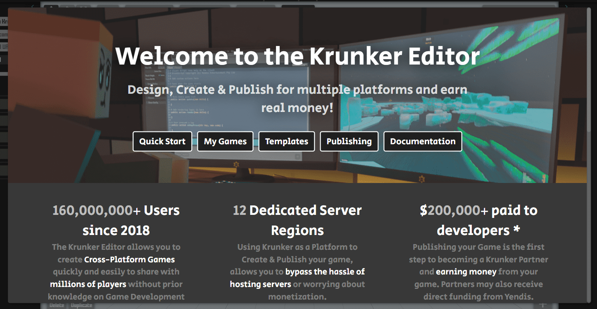

## Concept

The first step when creating your game should always be to come up with a concept of how you want your game to work and feel.\
It doesn't have to be very specific. As long as you have a general idea of the gameplay, it's fine; it's important to start small.

You can always expand on a simple concept in future [Iterations](./files/your_first_game?id=iterative-design).\
If you need some inspiration, check out our list of [Examples](./files/examples_&_templates?id=non-script-examples) or see if you can find a game concept you like elsewhere:

[KetchApp](http://www.ketchappgames.com/games/) - Simple Games\
[WebArcade](http://www.freewebarcade.com/game-collections.php) - Simple Games\
[Simple Arcade](http://thesimplearcade.com/) - Classic Flash Games

  

## Create a Game

Once you have an idea of how you want your game to work and look, you can start working on it.\
To get started, open the [Krunker Editor](https://krunker.io/editor.html).\
From there you will be greeted with the following popup:

Depending on what youre trying to make, you can use one of our [Templates](./files/examples_&_templates?id=basic-templates) to kickstart your project.\
Otherwise just select "Quick Start".

---

For more information on creating your first game, check out the [Additional Learning](./files/additional_learning) section.

  

## Iterative Design

In short, Iterative design is a circular design process that models, evaluates and improves designs based on the results of testing.\
This allows you to test the potential success of your game without investing too much time upfront.